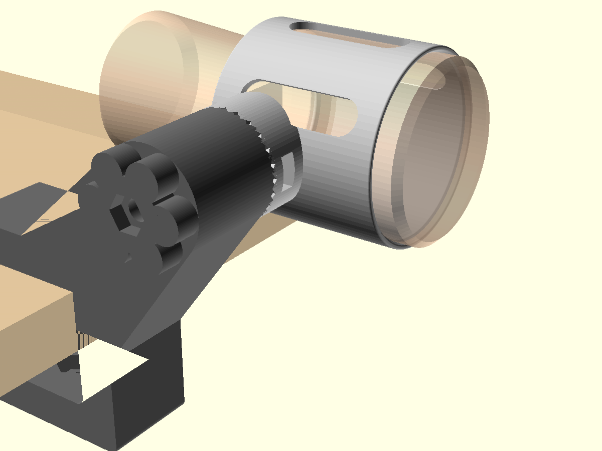

# Stroker desk mount

A parametric OpenSCAD mount that clamps to a desk edge and holds a caseless sleeve-style
stroker (the Doc Johnson sleeve in the photos). The pivot has 15° steps, so you can angle it.



## How it holds the sleeve

The sleeve has a wide front section, a narrow waist, then a flared rear. The **cradle** is a
tube that grips the wide section. A lip at the back of the tube sits in the waist:

- Pushing in drives the wide section's shoulder against the lip, so the sleeve can't be pushed through.
- Pulling out is stopped by the rear flare, which catches on the back of the lip.

To load it, squeeze the rear flare and push it through the lip from the front.
The slots let water drain and make it easier to clean.

## Parts

| File         | Qty | Print orientation                          |
|--------------|-----|--------------------------------------------|
| `clamp.stl`  | 1   | On its flat side, with the teeth facing up |
| `cradle.stl` | 1   | Standing on the lip end, with the tube upright |
| `knob.stl`   | 2   | With the hex pocket facing up              |
| `pad.stl`    | 1   | Flat side down (optional; stick felt or rubber on it) |

Use PETG or ABS/ASA with 4+ perimeters and 30–40% infill for the clamp and cradle.
PLA works, but it creeps under constant clamping load and softens in hot water.

**Hardware:** 2× M8×60 hex bolts and 2× M8 hex nuts.

## Assembly

1. Press an M8 bolt head into each knob; a drop of CA glue holds it.
2. **Clamp screw:** drop a nut into the hex pocket inside the lower jaw. Thread a knob-bolt up
   through it from below and put the pad on the tip.
3. **Pivot:** slide a nut into the slot in the cradle boss. Mesh the cradle's teeth with the
   clamp's teeth, then pass the second knob-bolt through the clamp ear into that nut.
   To change the angle, loosen the knob, rotate the cradle, and tighten again.

## Fitting it to your sleeve (important)

The default numbers are estimates from the photos. Measure yours with calipers, or wrap a paper strip around it and divide the length by π.
Then edit the top of `stroker_desk_mount.scad`:

| Parameter  | What to measure                                   | Default |
|------------|---------------------------------------------------|---------|
| `body_d`   | Diameter of the wide section                      | 72      |
| `body_len` | Entrance face to where the waist starts           | 75      |
| `waist_d`  | Diameter at the narrowest part of the waist       | 55      |
| `squeeze`  | How much tighter the bore is than `body_d`        | 1.0     |
| `desk_max` | Thickest desk the clamp should fit                | 50      |
| `pivot_up` | Pivot height above the desktop (use a negative number to mount it under the edge) | 45 |

Before printing the full cradle, print a test ring. Set `wall = 1.6` and shorten `body_len`.

Export each part:

```sh
for p in clamp cradle knob pad; do
  openscad -D "part=\"$p\"" -o $p.stl stroker_desk_mount.scad
done
```
